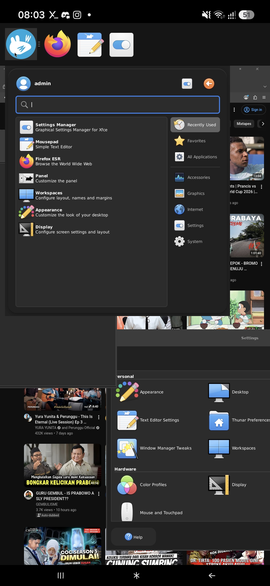
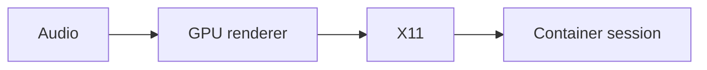
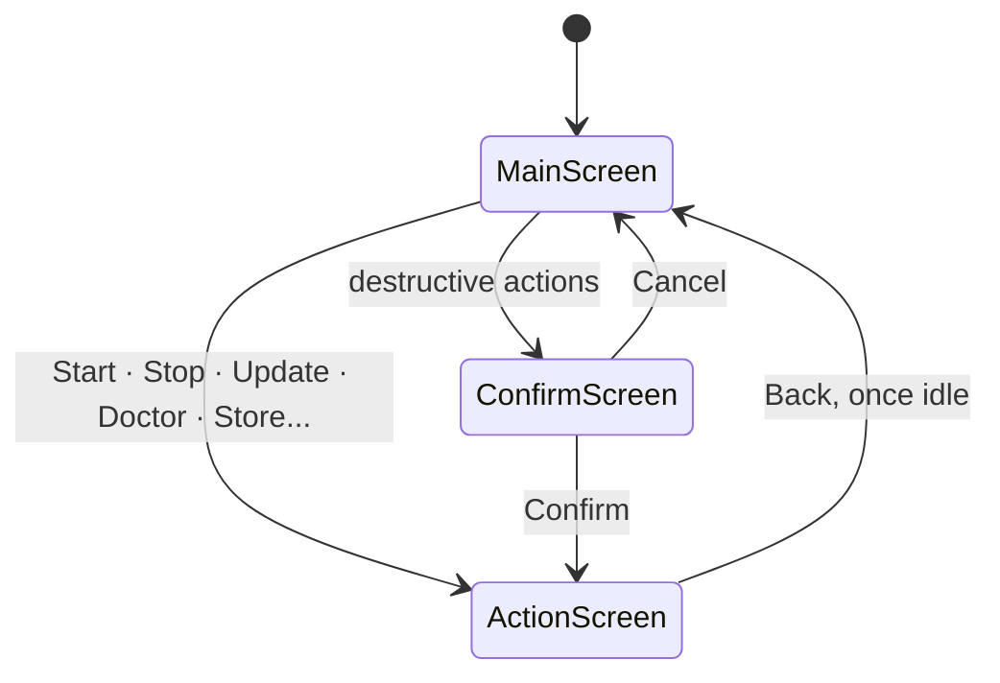
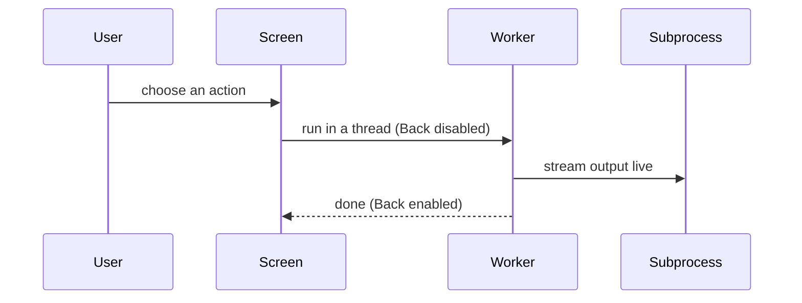

<div align="center">
  <h1>📱 PDM — Proot-Distro Manager</h1>
  <p><strong>Your phone is a Linux workstation — any distro, not just the one it ships with.</strong></p>
  <p>A Debian 13 + XFCE desktop inside Termux by default, no root — or pick
  any image proot-distro can pull and install that instead. Driven from a
  touch-friendly TUI, not a wall of shell scripts.</p>
  <p>
    <a href="https://github.com/arinadi/proot-distro-manager/actions"></a>
    <a href="https://github.com/arinadi/proot-distro-manager/blob/main/LICENSE"></a>
    <a href="https://github.com/arinadi/proot-distro-manager/commits/main"></a>
    <a href="https://github.com/arinadi/proot-distro-manager/stargazers"></a>
  </p>

  ```bash
  curl -sL https://raw.githubusercontent.com/arinadi/proot-distro-manager/main/install.sh | bash
  ```

  
  <p>
    Stable, usable Linux as Portable Service & Dev Tools<br>
    <small>Termux&nbsp;&nbsp;·&nbsp;&nbsp;proot-distro&nbsp;&nbsp;·&nbsp;&nbsp;XFCE&nbsp;&nbsp;·&nbsp;&nbsp;X11&nbsp;&nbsp;·&nbsp;&nbsp;Textual</small>
  </p>
</div>

---

## ⚡ Why

Your phone is a pocket PC with 8GB+ RAM and an ARM64 CPU — it deserves a real desktop. PDM sets one up declaratively, in one step:

| Problem | PDM Solution |
|---------|----------------------|
| Chrome sleeps tabs | Firefox ESR desktop browser — stays alive |
| No glibc apps | Debian 13 proot — standard glibc |
| 30 min of apt + config | Pre-built OCI image, pulled in one step |
| Fiddly X11 + audio + dbus startup | One menu entry, with cleanup on stop |
| Teardown that leaves stale locks | One teardown path, verified before it reports success |
| Locked into one distro | **Manual Install** — any image proot-distro can pull |

**Can't do:** Docker, systemd services, native x86, real root (proot fakes it). See [Limitations](#️-limitations).

---

## 🌱 Design

A from-scratch Python [Textual](https://github.com/Textualize/textual) TUI,
not shell scripts — idempotent, resumable,
[tested](tests/run_tests.py) on every push. The system image is declarative
(`Dockerfile`, built by CI) instead of a script run against whatever state
the phone happens to be in. **Doctor** diagnoses and fixes named failure
modes — DNS, timezone, the Electron sandbox, per-device GPU/audio — instead
of "reinstall and hope."

[XLabs](https://github.com/arinadi/XLabs) covers this same ground for one
fixed recipe — Debian 13 + XFCE4 — and puts all its effort into that one
path working reliably. PDM starts from that same codebase and the same
philosophy, then opens the front door: **Manual Install** lets the
container be *any* proot-distro image, not only the prebuilt one. Both
GPLv3.

---

## 🚀 Quick Start

### Install (one-time)

```bash
curl -sL https://raw.githubusercontent.com/arinadi/proot-distro-manager/main/install.sh | bash
```

`install.sh` bootstraps git, Python and this repo, then `install.py` does the
rest — Termux packages, the default Debian container, the `pdm` launcher.
Safe to re-run; each step skips what's already done, so an interrupted
install just resumes.

**One manual step:** sideload the
[Termux:X11 app](https://github.com/termux/termux-x11/releases/tag/nightly) —
`pkg` can only install Termux packages, not Android apps. The installer and
Doctor both flag it if missing.

Then open a new terminal session:

### Daily Use

```bash
pdm                     # Launch the TUI
```

The menu is sized for a thumb:

| | | |
|---|---|---|
| **Start Desktop** | **Stop Desktop** | |
| **Manual Install** | | |
| Update | Store | Settings |
| Doctor | Backup | |
| Reset | Cache | |

Everything is tappable — Termux delivers touches as mouse events. Full
reference below in [The TUI, screen by screen](#-the-tui-screen-by-screen).

---

## 🏗️ How It Works

Two layers: the **core** (declarative — `image/Dockerfile`, built by CI,
published to `ghcr.io/arinadi/proot-distro-manager`) and your **user layer**
(whatever you install inside the container — survives restarts, wiped by
Reset). That core is the *default*, not the only option — see
[Manual Install](#manual-install) below.

Image pulls try GHCR first, falling back to Docker Hub — GHCR has no rate
limit, which matters on mobile data behind carrier NAT where Docker Hub's
anonymous-pull limit is shared with everyone else on the same IP.

Starting the desktop is a chain, torn down in reverse on stop:



### Python TUI

Built with [Textual](https://github.com/Textualize/textual). Every action
runs in a background thread, so a slow image pull streams live without
freezing the interface. Every screen returns to the menu, and anything
destructive is gated behind a confirm step first:



Back is disabled while a job is running, so leaving mid-install can't strand
the container half-set-up. A watchdog kills the whole process tree if it hangs:



---

## 🖥️ The TUI, screen by screen

<!-- screenshot: main menu -->

Built for a thumb, not a mouse: full-width buttons, generous spacing, Back
always at the bottom. Button size follows Termux's terminal font size — if
buttons feel too small to tap reliably, raise the font size (pinch-to-zoom or
Termux's Style menu), not something PDM controls from the Python side.

### Start Desktop

1. **Wake lock** — keeps Android from freezing the session
2. **Audio** — PulseAudio, plus the socket the container will use
3. **GPU renderer** — first virgl/ANGLE backend found, else software
4. **X11** — `termux-x11 :0`, waits for the socket to actually accept
5. **Session** — `dbus-launch startxfce4` as `admin`

Always runs a full stop first — stale sockets and orphaned proot processes
are exactly what break the next start. If the desktop doesn't come up, a
full diagnostic report is collected automatically. A container installed
via **Manual Install** without a desktop environment has nothing for this
to start — that's expected, not a failure; use it as a shell instead.

### Stop Desktop

<!-- screenshot: stop -->

Innermost first: the container's proot tree, then X11, then audio, then a
sweep for anything left over. No polite XFCE logout — a fresh proot login
has no D-Bus session to ask for one, so it's `TERM` then `KILL` throughout,
and it **verifies with `pgrep`** rather than just claiming success.

### Manual Install

<!-- screenshot: manual install -->

Replaces whatever is currently installed with **any image proot-distro can
pull** — `ubuntu:24.04`, `alpine:latest`, `archlinux:latest`,
`ghcr.io/org/image:tag`, anything. Five quick-pick buttons (Debian, Ubuntu,
Alpine, Arch, Fedora) fill in a starting reference; the field itself takes
whatever you type.

This is the same container slot **Reset** uses, not a second, independent
one — Start, Doctor, Backup and everything else still only know about the
one container named in `installer/const.py`. Picking a different image
here doesn't add a container alongside the default; it replaces it, exactly
like Reset does, just pointed somewhere else. True multi-container support
is on the [roadmap](#-roadmap), not built yet.

Most images have no desktop environment baked in — that's specific to
PDM's own prebuilt one. Install one afterward from **Store** (works once
the image's package manager is apt; other package managers are also on the
roadmap), or use the container as a plain shell.

### Update

`git pull --ff-only`, hard-resetting to `origin/main` if that's refused. A
**Restart** button relaunches `pdm` on the new code — pulling alone doesn't
update a process that's already running.

### Store

<!-- screenshot: store search -->

A package browser for the container. Search, see what's already installed
(**I**), tap **Install** — apt runs inside the container with output
streamed live, Termux untouched. First search is slower: the image ships
without package lists to stay small, so it fetches them once.

**Mirror** switches which Debian mirror apt uses — **Measure** times a real
download from each candidate and picks the fastest, **Refresh** pulls the
current list from Debian itself. Security updates are always kept pointed at
`security.debian.org` regardless of mirror, so switching never breaks
`apt update`.

**Repos** adds signed third-party sources:

| Repo | What it gives you |
|------|-------------------|
| `backports` | Newer packages from Debian itself |
| `mozilla` | Firefox tracking release rather than ESR |
| `vscode` | Visual Studio Code |

**Add** takes any repository — name, URI, key URL. A signing key is
required, and every field is validated before it's written.

Store is apt-specific today — a container installed via Manual Install onto
a non-Debian image (Alpine's `apk`, Arch's `pacman`, Fedora's `dnf`) won't
have a working Store yet. See the [roadmap](#-roadmap).

### Doctor

<!-- screenshot: doctor -->

One screen, full checkup: internet, Python, the container, storage, DNS,
timezone, GPU, audio, and more — each shown as ● present, ○ missing, or
**?** unknown.

- **Fix (N)** repairs everything repairable in one press
- **DNS** — repoints `resolv.conf` at public DNS when name resolution breaks
- **Timezone** — matches Android's zone (the image ships as UTC)
- **Electron apps** (VS Code, etc.) — patches launchers with `--no-sandbox`;
  their sandbox can't initialize under proot, so without this they don't
  open at all
- **Video** — turns off VP9/AV1 in Firefox so YouTube doesn't stutter
  (no hardware video decode under proot — everything falls back to CPU)
- **Audio** — benchmarks unix/tcp, with and without shared memory, keeps
  whichever actually plays
- **Bench** — runs glmark2 across GPU presets (virgl, ANGLE, zink,
  software) and keeps the fastest
- **Dupes** — tools installed in both Termux and the container; can remove
  the Termux copies, container treated as primary

Recording audio isn't possible — Termux doesn't hold the microphone
permission, so there's no source to capture from.

Most checks here are host-level (Termux/Android facts) and apply to any
container. A few — the Debian security-archive fix, the Electron sandbox
patch — assume Debian/apt and a desktop environment. On a container from
Manual Install, those specific checks quietly find nothing to check rather
than misreporting; see the [roadmap](#-roadmap) for making that pluggable
per distro instead of Debian-shaped by default.

### Settings

<!-- screenshot: settings -->

Per-device overrides, saved to `.env` — mostly for when auto-detection (GPU
Bench, Audio method) picks wrong, plus `termux-x11` rendering flags for
devices with a black screen or swapped colors. All take effect on next
restart. **Uninstall PDM** lives here too, behind the same confirm as
Reset.

### Backup

<!-- screenshot: backup -->

Archives `/home/admin` — dotfiles, browser profile, editor config, panel
layout — not apt packages, which reinstall themselves. Runs `tar` **inside**
the container rather than copying files from the host, since proot's
ownership and hardlink emulation don't survive a raw copy. Stored outside
the container under `~/pdm-backups`, so a **Reset** can't take a backup
down with it.

A backup dropped into [`presets/`](presets/) in this repo (instead of
`~/pdm-backups`) is your own — PDM doesn't ship one. Commit it, and
`install.py` restores it the first time it ever pulls the container on a
device — not on every run, and not from the TUI: see
[`presets/README.md`](presets/README.md) for why it's scoped that
narrowly.

### Reset and Cache

**Reset** deletes the container and pulls a fresh copy of PDM's default
image. **Cache** drops downloaded image layers only. Both confirm first. To
reinstall with something other than the default, use **Manual Install**
instead of Reset.

### Copying anything

Every output screen has a **C** button / `c` key — tries the Android
clipboard, then the terminal's OSC 52, and always mirrors to a file too,
since neither clipboard path is guaranteed to work.

### Keys

| Key | Where |
|-----|-------|
| `q` | Quit, from the menu |
| `Escape` | Back — refused while an action is running |
| `c` | Copy the screen's output |
| `Enter` | Run the search, in Store |

Layout holds down to a 36-column terminal.

---

## 📦 What's Included

The default image is a **vanilla baseline** on purpose — the standard
Termux + proot + XFCE recipe, plus a browser:

| Category | Packages |
|----------|----------|
| 🖥️ Desktop | `xfce4`, `xfce4-terminal`, `dbus-x11` |
| 🌐 Browser | `firefox-esr` |
| 🎮 Graphics | Mesa userspace, `x11-xserver-utils`, `mesa-utils` |
| 🔊 Audio | `pulseaudio-utils` (client; server runs in Termux) |
| 🧱 Base | `ca-certificates`, `locales`, `sudo` |

Installed **with** recommends — trimming them broke `xfwm4`/`xfdesktop` in
an earlier build. Anything else is a search away in [Store](#store) — or a
different starting point entirely, via [Manual Install](#manual-install).

---

## 🎮 Graphics

No GPU vendor detection — the start sequence just tries renderers in order
and takes the first that exists: virgl, then ANGLE (Vulkan), then software.
The default image ships Mesa userspace either way, so OpenGL works
regardless.

---

## 📂 Structure

```
proot-distro-manager/
├── install.sh          ← Bootstrap: git, Python, repo checkout
├── install.py          ← Full installer
├── pdm                 ← TUI launcher
├── installer/          ← TUI package
│   ├── app.py          ←   Textual app: screens, runners
│   ├── app.tcss        ←   Styling
│   ├── start.py        ←   Desktop lifecycle
│   ├── preflight.py    ←   Environment checks (pure stdlib)
│   ├── system.py       ←   Subprocess helpers, image pulls
│   └── const.py        ←   Paths and names
│   └── doctor.py       ←   Diagnosis and repair
│   ├── bench.py        ←   GPU benchmark and profile
│   ├── config.py       ←   .env, per-device settings
│   ├── backup.py       ←   Home directory backup/restore
│   └── presets.py      ←   Restore a repo-tracked preset (see backup.py)
├── image/              ← Default image definition (Dockerfile + configs)
├── tests/              ← Headless TUI tests, run by CI
├── docker/dev/         ← Local TUI test harness
├── presets/            ← Your own backup, restored on fresh installs
└── docs/               ← Debugging notes and references
```

---

## 🔁 Termux and the container overlap

By design: proot-distro binds Termux's `$PREFIX` into the container and
appends it to the container's `PATH`, so Termux's binaries are reachable
inside as a fallback (the container's own copy always wins when both
exist). `--shared-tmp` does the same for `/tmp` — it's literally the same
directory on both sides.

`Doctor → Dupes` finds tools installed on both and can remove the Termux
copies, on the assumption the container is where you work. It never
touches anything PDM itself needs.

---

## ⚠️ Limitations

| Limitation | Workaround |
|-----------|------------|
| No root | proot provides root-like environment |
| No systemd | Start services manually |
| No GPU passthrough | virgl renderer, software fallback |
| ARM64 only | QEMU for cross-arch (slow) |
| No native X11 | Termux:X11 app required |
| No Docker or Podman | See [Containers](#-containers-docker-podman) |
| Store/Doctor assume Debian | See [Roadmap](#-roadmap) |
| One container at a time | See [Roadmap](#-roadmap) |

---

## 🐳 Containers: Docker, Podman

Neither runs — it's an Android kernel limitation (no user namespaces or
cgroups for regular apps), not something proot or PDM can patch around.
Plain rootless Podman hits the same wall even without proot involved at
all, so this isn't a PDM gap specifically.

Rooting the phone and flashing a custom kernel removes the wall. So does a
different approach entirely, like [Podroid](https://github.com/aanundgit/podroid),
which runs a full VM instead of proot — heavier, and out of scope here.

**For a normal dev toolchain** — a language runtime, a database, a build
tool — [Store](#store) installs it straight into the container (on
Debian-based images today). No container-inside-container needed for that.

---

## 🗺️ Roadmap

PDM starts from XLabs's single-container, single-distro codebase and opens
one door — Manual Install. The rest of what "flexible" could mean here is
still ahead, roughly in the order it'd actually get built:

- **Multi-container management.** Today, "the container" is one name
  (`installer/const.py`) that Start, Stop, Doctor, Backup, Store and Reset
  all assume. A container **list** instead — name, distro, desktop,
  created date, size — with Start/Stop/Reset/Cache becoming per-container
  actions from a picker, plus an overview screen and the ability to clone
  a container before doing something risky to it.
- **Pluggable Store.** A package-manager abstraction (apt / apk / pacman /
  dnf) selected by the container's actual distro, so Store works on
  whatever Manual Install pulled, not only Debian.
- **Pluggable Doctor.** Host-level checks (DNS, timezone, stale sockets,
  storage, Termux:X11, GPU/audio) stay shared across every container.
  Distro-specific checks — Debian's security-archive bug, Alpine's
  musl-vs-glibc proot quirks, Arch's pacman keyring init, Fedora's dnf
  slowness on mobile data — become named fixes per package manager,
  matching the existing philosophy of diagnosing specific failure modes
  instead of "just reinstall."
- **Desktop environment choice**, not just distro choice: XFCE (today's
  recipe), LXQt/MATE as lighter alternatives, or headless/CLI-only for a
  pure dev shell with no X11 at all.
- **Curated recipes** — one-tap combos ("Debian + XFCE dev", "Alpine + CLI
  minimal") instead of typing a raw image reference every time, built on
  top of Manual Install rather than replacing it.
- **Per-container Backup/Restore/Presets** — the username and home path
  currently assume `admin`/Debian; this travels with each container's own
  metadata once multi-container support exists, and presets become a
  small manifest (distro + DE + packages + dotfiles) rather than just a
  raw tar.

None of this is committed to a timeline — it's the shape the project is
aimed at, kept here so a contribution knows where it fits rather than
guessing.

---

## 🛑 Android 12+ Phantom Process Killer

Background processes can get killed by Android. Disable it:

- **Android 14+:** Developer Options → Disable child process restrictions
- **Android 12–13:** `adb shell settings put global settings_enable_monitor_phantom_procs false`

---

## 📜 License

GPLv3 — see [LICENSE](LICENSE). Forked from
[XLabs](https://github.com/arinadi/XLabs), which itself credits DroidDesk
for the original idea and starting point.
